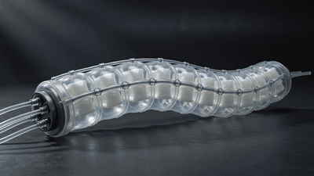
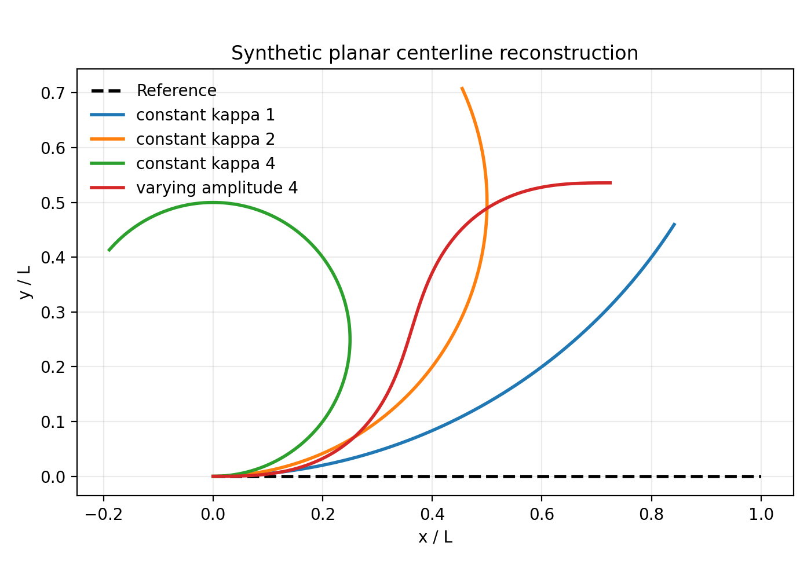
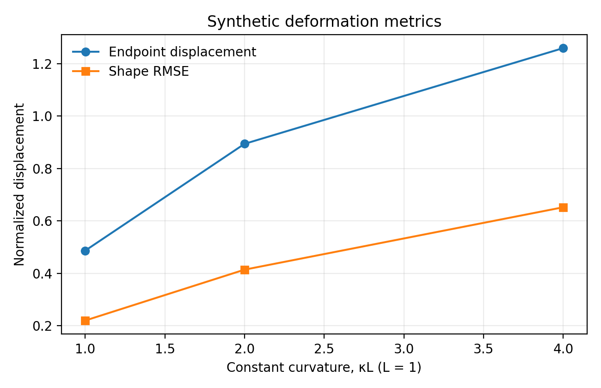

# Soft Robot Kinematics

This repository implements a compact, reproducible model for planar soft-robot centerline reconstruction. It represents deformation through a curvature field defined along a normalized material coordinate, integrates the tangent angle, reconstructs the centerline, and reports geometric deformation metrics.

The code is a research scaffold for studying kinematics and shape change. All figures and numerical outputs included here are generated from synthetic curvature fields; they are not experimental validation.

## Visual Motivation

[](media/soft_robot_deformation.mp4)

*Visual example of large, time-varying deformation in a soft robotic structure. This video is included as motivation for geometric shape modeling and is not experimental validation of the current implementation.*

## Current implementation

- straight reference centerline `X0(s)` and reconstructed configuration `x(s, t)`;
- normalized material coordinate `s ∈ [0, 1]`;
- zero, constant, and spatially varying synthetic curvature fields;
- tangent-angle and centerline reconstruction by cumulative trapezoidal integration;
- pointwise, mean, maximum, and endpoint displacement;
- shape RMSE and curvature RMSE;
- relative polyline arc-length consistency error for numerical checking;
- tested synthetic examples at multiple curvature amplitudes.

For normalized coordinate `s` and physical length `L`, the planar model uses

```text
θ(s, t) = θ0 + L ∫₀ˢ κ(ξ, t) dξ
x(s, t) = x0 + L ∫₀ˢ [cos θ(ξ, t), sin θ(ξ, t)]ᵀ dξ.
```

The implementation assumes corresponding material points and prescribed curvature. It does not solve mechanics, contact, or material constitutive equations.

## Synthetic results





The example evaluates a straight identity case, three constant-curvature cases, and two sinusoidal-curvature cases. Computed values are stored in [`examples/synthetic_metrics.csv`](examples/synthetic_metrics.csv). The identity case provides a basic numerical check: all displacement and curvature-difference metrics are zero. The CSV also reports relative polyline arc-length error against the prescribed length as a discretization consistency check. It is not a measure of extension or strain.

## Installation

```bash
git clone https://github.com/zanax1990/soft-robot-kinematics.git
cd soft-robot-kinematics
python -m venv .venv
source .venv/bin/activate
pip install -r requirements.txt -r requirements-dev.txt
pip install -e .
```

On Windows, activate the environment with `.venv\Scripts\activate`.

## Run the examples

```bash
python examples/run_synthetic_examples.py
```

Custom output locations and discretization can be supplied explicitly:

```bash
python examples/run_synthetic_examples.py \
  --num-points 801 \
  --length 1.0 \
  --output-dir figures \
  --metrics-output examples/synthetic_metrics.csv
```

## Run the tests

```bash
pytest
```

The tests cover array dimensions, finite outputs, zero-curvature reconstruction, the constant-curvature circular-arc endpoint, identity deformation, matching metrics, and invalid inputs.

## Repository structure

```text
.
├── src/soft_robot_kinematics/  # geometry and metric functions
├── examples/                   # synthetic experiment and computed metrics
├── tests/                      # unit tests
├── figures/                    # generated synthetic figures
├── media/                      # deformation video and preview
├── docs/                       # model definition and assumptions
└── .github/workflows/          # continuous integration
```

## Limitations

- planar centerline geometry only;
- prescribed curvature rather than force-driven deformation;
- no shear, extension, contact, dynamics, or constitutive model;
- numerical results are synthetic and discretization-dependent;
- no image-derived or experimental parameter estimation.

## Research directions

The next research stage is to connect centerline reconstruction with image or video observations and experimental measurements. Candidate investigations include physics-enhanced parameter estimation, machine-learning models for curvature or state inference, deformable-body and viscoelastic effects, and long-term drift. A multiscale description with an evolving reference `X0(s, τ)` and fast deformation `x(s, t, τ)` is also a research direction, not a capability of the current implementation.
